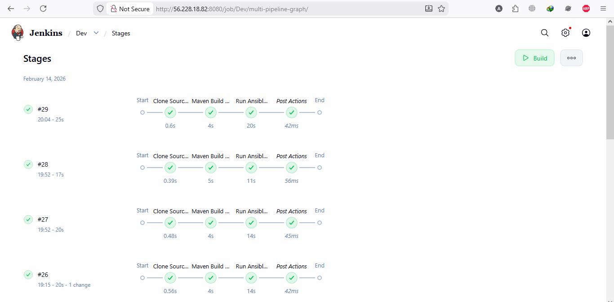
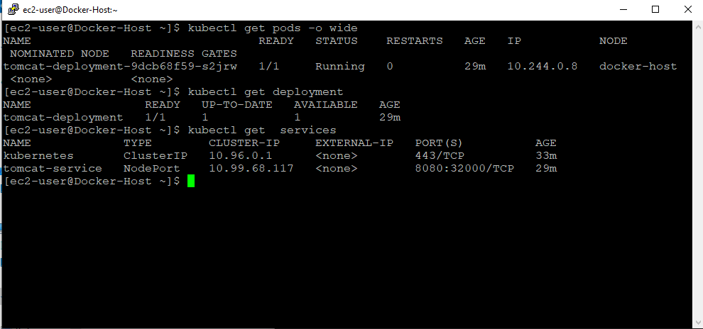
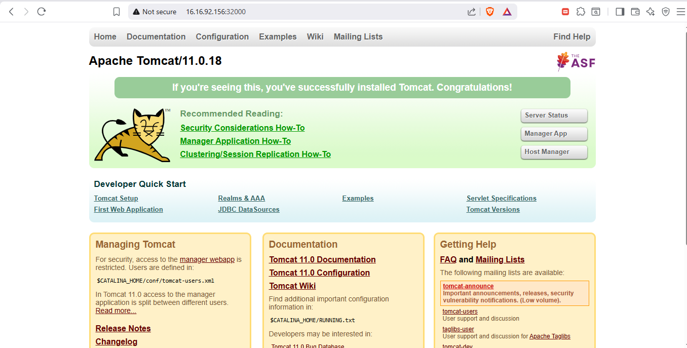

 🚀 Complete End-to-End CI/CD DevOps Project on AWS (Java Tomcat + Kubernetes)

📌 Project Overview

This project demonstrates a complete end-to-end DevOps CI/CD pipeline built from scratch on AWS EC2, covering the full lifecycle from source code integration to production‑style Kubernetes deployment of a **Java Tomcat web application**.

The goal of this project was to gain **real-world practical DevOps experience** by implementing automation, containerization, orchestration, and cloud deployment in a single integrated workflow.

 🏗️ Architecture Flow

GitHub → Jenkins → Maven Build → Docker Image → Docker Hub → Ansible Automation → Kubernetes (kubeadm) → Public Access via NodePort

This represents a real CI/CD pipeline used in production environments

🛠️ Technology Stack

* AWS EC2 – Cloud infrastructure
* GitHub – Source code management
* Jenkins – Continuous Integration & pipeline automation
* Maven – Java application build & packaging
* Docker – Containerization of Tomcat application
* Docker Hub – Container image registry
* Ansible – Automation & deployment orchestration
* Kubernetes (kubeadm) – Production‑style container orchestration
* Java + Apache Tomcat – Web application runtime

 ⚙️ CI/CD Pipeline Workflow

 1️⃣ Source Code Integration

 Application source stored in GitHub repository
 Jenkins pipeline automatically pulls latest code from the main branch

 2️⃣ Build & Test Stage

* Maven compiles the Java project
* Runs unit tests
* Generates WAR artifact for Tomcat deployment

 3️⃣ Containerization

* Docker image created using project Dockerfile
* Image tagged with version
* Image pushed to **Docker Hub repository**

 4️⃣ Automation with Ansible

 Ansible playbooks automate:

  * Docker image build & push
  * Kubernetes deployment execution

5️⃣ Kubernetes Deployment (kubeadm cluster)

* Kubernetes cluster created using kubeadm
* Tomcat application deployed using:

  * Deployment (pod management & scaling)
  * NodePort Service (external public access)

 6️⃣ Public Application Access

* Application exposed via:

  http://<EC2-PUBLIC-IP>:<NODEPORT>
  
🚀 How to Run This Project

Prerequisites

* AWS EC2 instance (Ubuntu/Amazon Linux)
* Installed tools:

  * Docker
  * Jenkins
  * Maven
  * Ansible
  * Kubernetes (kubeadm, kubelet, kubectl)
 Basic Steps

bash
# Clone repository
git clone https://github.com/AhmadButt97/CI-CD-Project.git

## ⚙️ Jenkins Pipeline Execution

  

---

## ☸️ Kubernetes Deployment & Running Pods

  

# Or run Ansible manually
ansible-playbook playbook.yml
ansible-playbook k8s-deploy.yml

## ☸️ FUll tomcat App

  

 📚 Key Learning Outcomes

* Built a real CI/CD pipeline from scratch
* Learned difference between **Minikube vs kubeadm production setup**
* Hands‑on troubleshooting of:

  * CI/CD failures
  * Docker build issues
  * Kubernetes pod scheduling
  * Cluster networking & NodePort exposure
* Improved **cloud, automation, and DevOps debugging skills**

 🎯 Future Improvements

* Multi‑node Kubernetes cluster
* Helm chart deployment
* CI/CD using GitHub Actions
* HTTPS with Ingress Controller
* Monitoring with Prometheus & Grafana

* GitHub: [https://github.com/AhmadButt97](https://github.com/AhmadButt97)
* LinkedIn: www.linkedin.com/in/ahmad-butt-199912346

---

## ⭐ Support

If you found this project useful, consider **starring the repository** ⭐ to support my DevOps learning journey.
